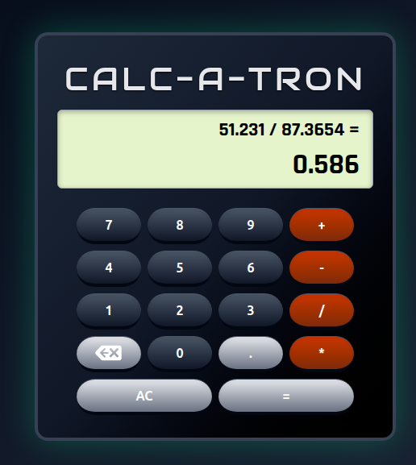

# Calc-A-Tron Application

## Project Description
From The Odin Project - Fundamentals, this is a simple calculator application that accepts 2 numbers and simple operator to produce the output

## User Interface

## Features
- Input via mouse clicks
- Input via keyboard
    - Numbers and operators work as expected
    - 'c' or 'escape' to clear calculator
    - 'b' or 'backspace' to backspace
    - '=' or 'enter' to calculate result
- Snarky message on attempt to divide by 0
- Input validation
- Use of math.js for safe evaluation of expression

## How to Run the Project
Save the following files in a directory:
- index.html
- output.css
- script.js
- favicon.png
- images/backspace.png

Open index.html in any modern web browser to start solving some maths!

## Technologies Used
- HTML: For structuring the user interface.
- TailwindCSS-CLI / CSS: For styling the user interface.
- JavaScript: For implementing functionality and interactivity.

## Known Bug-a-boo
- Occasionally on initial load, the 'expression' area will not populate correctly.  However, a reload of the page seems to fix it.  I tried to debug but since the manifestion is inconsistent I couldn't figure out what was happening.